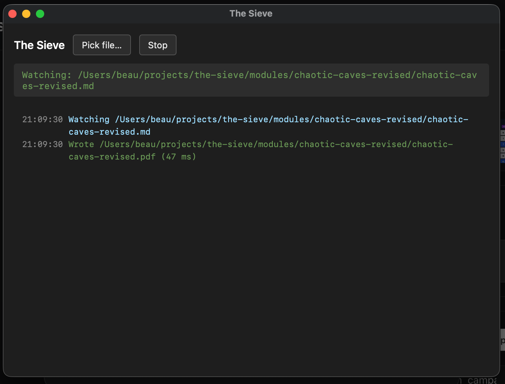

# The Sieve

Converts TTRPG-flavored markdown into half-letter (5.5" × 8.5") PDFs sized for booklet printing. Ships as both a command-line tool and a desktop app.

## Features

- **Stat blocks** via fenced code blocks (`` ```statblock ``)
- **Boxed read-aloud text** (`` ```boxed ``)
- **Single-column override** (`<!-- 1-column -->` / `<!-- 2-column -->`) with mid-page mode switching
- **Manual page breaks** (`<!-- pagebreak -->`)
- **Two-column balanced layout** with H1 banners spanning both columns
- **License appendix** (`<!-- license: ogl-1.0a -->` / `<!-- license: cc-by-sa-4.0 -->`)
- **PDF outline** so headings show up as a navigable bookmark tree in the viewer sidebar
- **Page numbers** in the bottom outer corner (right on odd pages, left on even — book convention)
- Standard markdown: headings, lists, tables, images, emphasis, code blocks

See [`STYLE_GUIDE.md`](STYLE_GUIDE.md) for the full set of supported features and `sample.md` for a minimal example.

## Download

Pre-built artifacts for each release are at the [Releases page](https://github.com/beaurancourt/the-sieve/releases/latest):

- **Desktop app** — installers for macOS (`.dmg`), Linux (`.AppImage` / `.deb`), and Windows (`.exe` / `.msi`). Pick a markdown file and the app rebuilds the PDF every time you save it.
- **Command-line binary** — single executable per platform for terminal use and scripting.

The release page describes which file to grab for your platform.

## Build from source

```sh
cargo build --release            # CLI: target/release/the-sieve
cargo build --release -p the-sieve-app   # Desktop app: target/release/the-sieve-app
```

No runtime dependencies — fonts are embedded into the binaries.

## CLI usage

```sh
the-sieve adventure.md                 # → adventure.pdf
the-sieve adventure.md -o booklet.pdf  # custom output path
the-sieve adventure.md --html-only     # emit intermediate HTML for debugging
```

## Desktop app



Open the app, click **Pick file…**, and select a markdown file. Every time you save the file the app rebuilds the PDF next to it (200 ms debounce so editor double-saves don't double-rebuild). The log panel shows each rebuild with timestamp and duration.

## How it works

`markdown → AST → PDF`. The renderer is built on [krilla](https://crates.io/crates/krilla) (PDF output) and [parley](https://crates.io/crates/parley) (paragraph layout, line breaking, font fallback). Fonts shipped with the binary: EB Garamond and JetBrains Mono (both OFL 1.1). The desktop app is a small [Tauri 2](https://v2.tauri.app/) wrapper around the same renderer.

## License

MIT — see [`LICENSE`](LICENSE).
